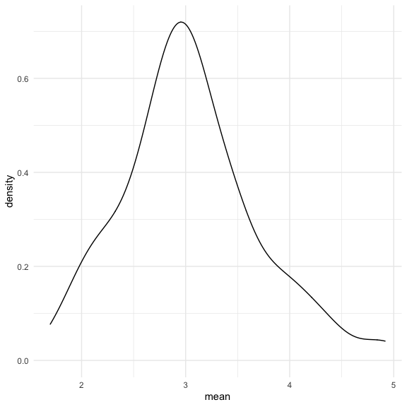
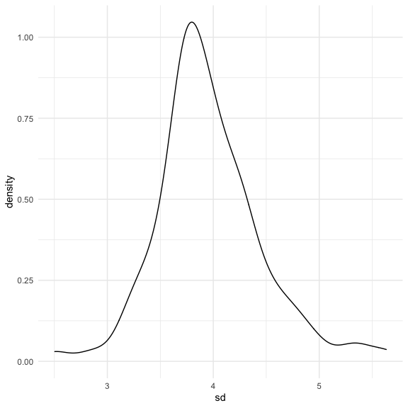
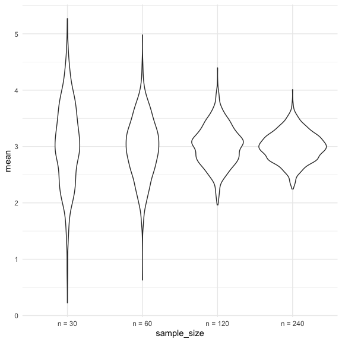

Simulations
================
Nidhi Patel
11/17/2020

``` r
library(tidyverse)
```

    ## ── Attaching packages ─────────────────────────────────────── tidyverse 1.3.0 ──

    ## ✓ ggplot2 3.3.2     ✓ purrr   0.3.4
    ## ✓ tibble  3.0.3     ✓ dplyr   1.0.2
    ## ✓ tidyr   1.1.2     ✓ stringr 1.4.0
    ## ✓ readr   1.3.1     ✓ forcats 0.5.0

    ## ── Conflicts ────────────────────────────────────────── tidyverse_conflicts() ──
    ## x dplyr::filter() masks stats::filter()
    ## x dplyr::lag()    masks stats::lag()

``` r
library(rvest)
```

    ## Loading required package: xml2

    ## 
    ## Attaching package: 'rvest'

    ## The following object is masked from 'package:purrr':
    ## 
    ##     pluck

    ## The following object is masked from 'package:readr':
    ## 
    ##     guess_encoding

``` r
knitr::opts_chunk$set(
  fig.width = 6,
  fig.height = 6,
  out.width = "90%")

theme_set(theme_minimal() + theme(legend.position = "bottom"))

options(
  ggplot2.continuous.colour = "viridis",
  ggplot2.continuous.fill = "viridis"
)

scale_color_discrete = scale_colour_viridis_d
scale_fill_discrete = scale_fill_viridis_d
```

## Let’s simulate something

I have this function

``` r
sim_mean_sd = function(samp_size, mu = 3, sigma = 4) {
  # mu = mean, sigma = sd
  sim_data = 
  tibble(
    x = rnorm(n = samp_size, mean = mu, sd = sigma)
  )

sim_data %>% 
  summarize(
    mean = mean(x),
    sd = sd(x)
  )
}
```

I can “simulate” by running this line

``` r
sim_mean_sd(30)
```

    ## # A tibble: 1 x 2
    ##    mean    sd
    ##   <dbl> <dbl>
    ## 1  3.20  3.70

## Let’s simulate a lot

Let’s start with a for loop

``` r
output = vector("list", length = 100) # length says we're running this sim 100 times

for (i in 1:100) { #for each iteration (1-100), i need to do the output
  output[[i]] = sim_mean_sd(samp_size = 30)
}

bind_rows(output) #gives a tibble of mean and sd outputs
```

    ## # A tibble: 100 x 2
    ##     mean    sd
    ##    <dbl> <dbl>
    ##  1  2.02  3.96
    ##  2  2.76  3.65
    ##  3  2.73  5.25
    ##  4  2.99  3.50
    ##  5  2.39  3.73
    ##  6  3.06  4.25
    ##  7  2.40  3.98
    ##  8  1.70  4.41
    ##  9  2.39  3.68
    ## 10  1.72  4.34
    ## # … with 90 more rows

Let’s use a loop fn

``` r
sim_results = 
  rerun(100, sim_mean_sd(samp_size = 30)) %>% 
  bind_rows()
#setting a seed. using set.seed tells r to use the same starting point when choosing a sample.
```

Let’s look at results

``` r
sim_results %>% 
  ggplot(aes(x = mean)) + geom_density()
```



``` r
sim_results %>% 
  summarize(
    avg_samp_mean = mean(mean),
    sd_samp_mean = sd(mean))
```

    ## # A tibble: 1 x 2
    ##   avg_samp_mean sd_samp_mean
    ##           <dbl>        <dbl>
    ## 1          3.04        0.648

``` r
sim_results %>% 
  ggplot(aes(x =  sd)) + geom_density()
```



## Let’s try other sample sizes

revisit the for loop

``` r
n_list = 
  list(
    "n = 30" = 30,
    "n = 60" = 60,
    "n = 120" = 120,
    "n = 240" = 240
  )

#I want to say when n = 30, run it 100 times and save it; when n is 60 run it 100 times and save it, etc

output = vector("list", length = 4)

#output[[1]] = f(input[[1]]) # i want to write a fn that will adhere to this input

 output[[1]] = rerun(100, sim_mean_sd(samp_size = n_list[[1]])) %>% 
                       bind_rows() #can copy and past this or just create a for loop
 for (i in 1:4) {
 output[[i]] = rerun(100, sim_mean_sd(samp_size = n_list[[i]])) %>%
   bind_rows()
 }
```

``` r
sim_results = 
tibble(
  sample_size = c(30, 60, 120, 240)
) %>% 
  mutate(
    output_lists = map(.x = sample_size, ~ rerun(1000, sim_mean_sd(.x))), #.x makes it really explicit.  The first argument to map is .x
    estimate_df = map(output_lists, bind_rows)
  ) %>% 
  #pull(estimate_df) #we can see all the df in the estimate list!!

#we don't need the output_lists, so tidy it up
  select(-output_lists) %>% 
#nest to do from a larger set to go to one object and a dataframe next to it (THE LIST!!) we unnest
  unnest(estimate_df)
```

Do some dataframe things\!\!

``` r
sim_results %>% 
  mutate(
    sample_size = str_c("n = ", sample_size),
    sample_size = fct_inorder(sample_size)
  ) %>% 
  ggplot(aes(x = sample_size, y = mean)) +
  geom_violin()
```



``` r
sim_results %>% 
  group_by(sample_size) %>% 
  summarise(
    avg_samp_mean = mean(mean),
    sd_samp_mean = sd(mean)
  )
```

    ## `summarise()` ungrouping output (override with `.groups` argument)

    ## # A tibble: 4 x 3
    ##   sample_size avg_samp_mean sd_samp_mean
    ##         <dbl>         <dbl>        <dbl>
    ## 1          30          3.04        0.740
    ## 2          60          2.98        0.539
    ## 3         120          3.02        0.357
    ## 4         240          3.00        0.265

We see here that the avg sample mean is around what we’re supposed to
see and if we do sd = 4 / sqrt(sample\_size). WHY 4??

We reran them 1000 times, which takes forever, and will take forever
when knitted. Use `cache =` in the {r} code chunk bracket to avoid
rerunning it and save the results ran.

`set.seed(1)` sets seed so we can choose a starting place if you want to
run diff tests over the same numbers. It will give you the same rando
numbers every time
